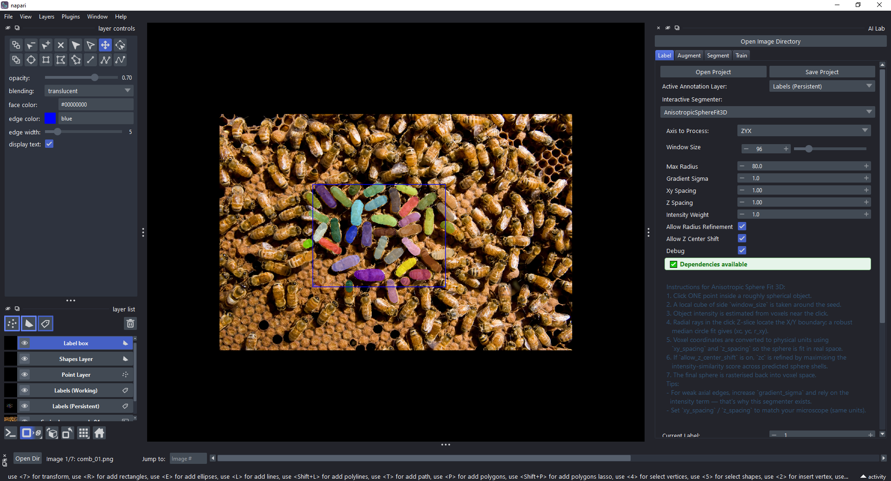

<!--
Source for docs/slides.pdf. Edit here, then in VS Code run
"Marp: Export Slide Deck..." and choose PDF. Commit both files.
-->

# Deep learning segmentation in Jupyter and napari

I2K 2026

## github.com/bnorthan/i2k-2026

Brian Northan, True North Intelligent Algorithms

---

# Under construction

scikit-ops and napari-ai-lab are very new.

Expect a few hiccups, and some changes ahead.

---

# The problem

- Compare Cellpose, StarDist in the 
- In one script, notebook, or Napari plugin
- Deep learning libraries need incompatible dependencies
- StarDist needs TensorFlow
- Cellpose 3 and Cellpose 4 can't be installed together
- Can't all be installed in one environment

---

# The approach

- appose
- pixi
- scikit-ops

Idea is one host application but each model run in its own environment.

TODO: one line each

---

# Napari-AI-Lab

- An API
- Interactive widgets
- Multi-framework comparison
- Compare on image sequences

---

# Everything is here

## github.com/bnorthan/i2k-2026

- Install at home. Several GB.
- Read `notebooks/08_getting_started.md`, then run `notebooks/10_installation_check.ipynb`
- Runs clean, you are ready
