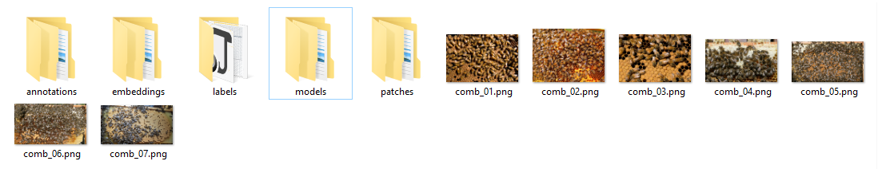

# 32 — Project organization

An AI Lab project is a folder of images. AI Lab adds its own folders beside
them as you work. This is the bees project after some labelling and one
training run.

## The images

- `comb_01.png` ... `comb_07.png` are the images.
- AI Lab reads them. It never changes them.

## The folders

**annotations**

- annotations are the image masks saved same size as the images.  Not all annotations have to be used for training.  That is where labels come in. 

**labels**

- The parts of the annotations marked with a label box.
- `input0/` holds the image crops, `truth0/` the matching label crops.
- `boxes.csv` records where each box is.
- Only these are used for training.
- so labels are the parts of the annotations that will be used for training (after augmentation)

**patches**

- The training set, made from the labels by augmentation.
- `input0/` holds the image patches, `ground_truth0/` the matching labels.
- This is what the training reads.

**models**

- The models you train, one per training run.
- Each has a `_history.csv` with the loss for each epoch.

**embeddings**

- SAM's embeddings, one folder per image.
- Computing one takes 20-60 seconds. After that it is saved here, so the next
  click on that image is fast.
- Safe to delete. They are made again when needed.

## The processes

We load images -> we use napari labeling tools or sam to create annotations -> we use bounding boxes to mark what part of annotations should be used for training -> we use augmentation to generate the actual patches used for training -> and after training we get models. 
