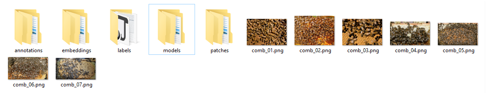

# 32 — Project organization

An AI Lab project is a folder of images. AI Lab adds its own folders beside
them as you work. This is the bees project after some labelling and one
training run.

## Annotations → Labels → Patches

- **Annotations:** what you draw, on the full image. Can be unfinished.
  - **napari brush/fill:** draw on **Labels (Persistent)**, not Working.
  - **SAM:** the result appears on **Labels (Working)**. Commit it to keep it.
  - Only **Labels (Persistent)** is saved.
- **Label box:** marks "this part is done".
- **Labels:** the annotations inside a label box. Only these train.
- **Patches:** labels, augmented. The training set.

**SAVE before you augment. Augment before you train.**

## The images

- `comb_01.png` ... `comb_07.png` are the images.
- AI Lab reads them. It never changes them.

## The folders

**annotations**

- Full-image masks, one per image.

**labels**

- The parts of the annotations marked with a label box.
- `input0/` holds the image crops, `truth0/` the matching label crops.
- `boxes.csv` records where each box is.
- Only these are used for training.

**patches**

- The training set, made from the labels by augmentation.
- `input0/` holds the image patches, `ground_truth0/` the matching labels.
- This is what the training reads.

**models**

- The models you train, one per training run.
- Each has a `_history.csv` with the loss for each epoch.

**embeddings**

- SAM's embeddings, one folder per image.
- Computing one takes 20-60 seconds. After that it is saved here, so the next
  click on that image is fast.
- Safe to delete. They are made again when needed.

