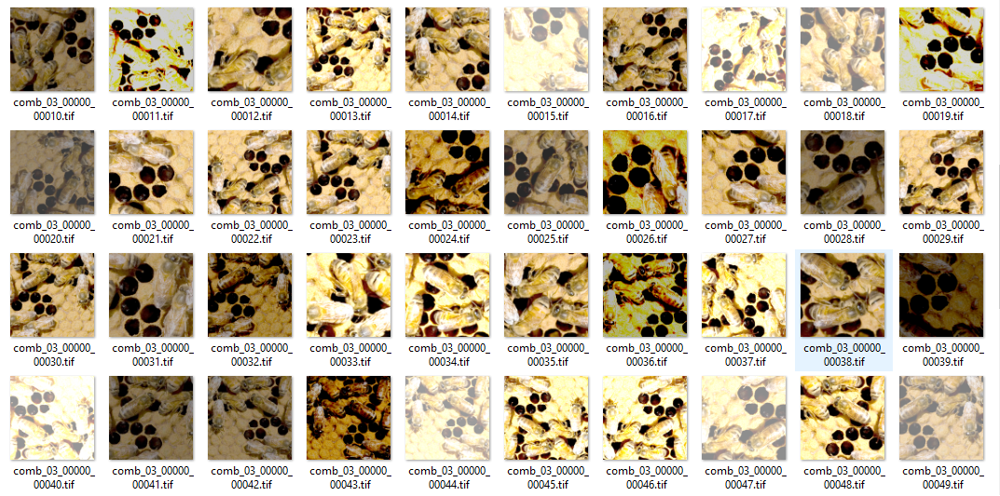

# 34 — From annotations to patches

- Annotate some bees in AI Lab.
- Draw a label box around the part you finished.
- Go to Augment tab and run 'Perform Augmentations'
- Press 'Show Patches' to preview the augmented patches.  
- The patches will be used for the training set.
- You can also verify the patches in a file browser.  

For example go to the data folder 'bees\patches\patches_axis_yxc\input0'

`comb_03_00000_00010.tif` is image `comb_03`, label box `00000`, patch `00010`.
