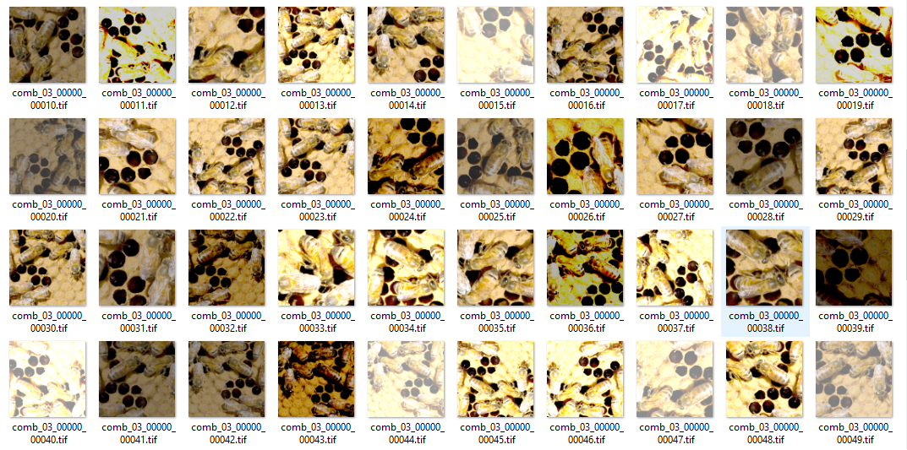

# 34 — From annotations to patches

## Annotations → Labels → Patches

- **Annotations:** what you draw, on the full image. Can be unfinished.
  - **napari brush/fill:** draw on **Labels (Persistent)**, not Working.
  - **SAM:** the result appears on **Labels (Working)**. Commit it to keep it.
  - Only **Labels (Persistent)** is saved.
- **Label box:** marks "this part is done".
- **Labels:** the annotations inside a label box. Only these train.
- **Patches:** labels, augmented. The training set.

**SAVE before you augment. Augment before you train.**

## Try it

- Annotate some bees in AI Lab.
- Draw a label box around the part you finished.
- Go to Augment tab and run 'Perform Augmentations'
- Press 'Show Patches' to preview the augmented patches.  
- The patches will be used for the training set.
- You can also verify the patches in a file browser.  

For example go to the data folder 'bees\patches\patches_axis_yxc\input0'

`comb_03_00000_00010.tif` is image `comb_03`, label box `00000`, patch `00010`.
